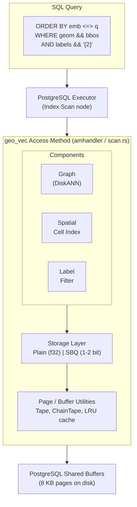
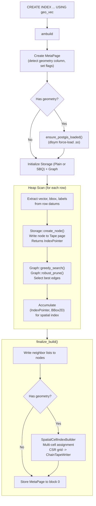
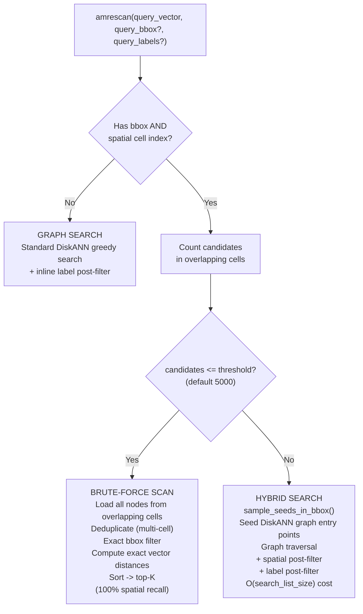
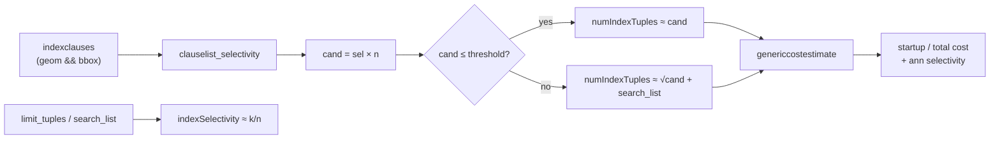
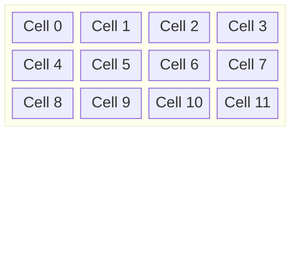
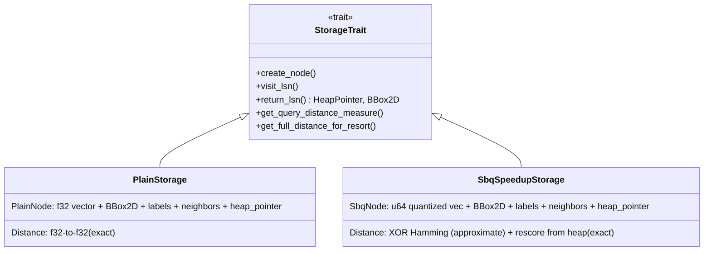
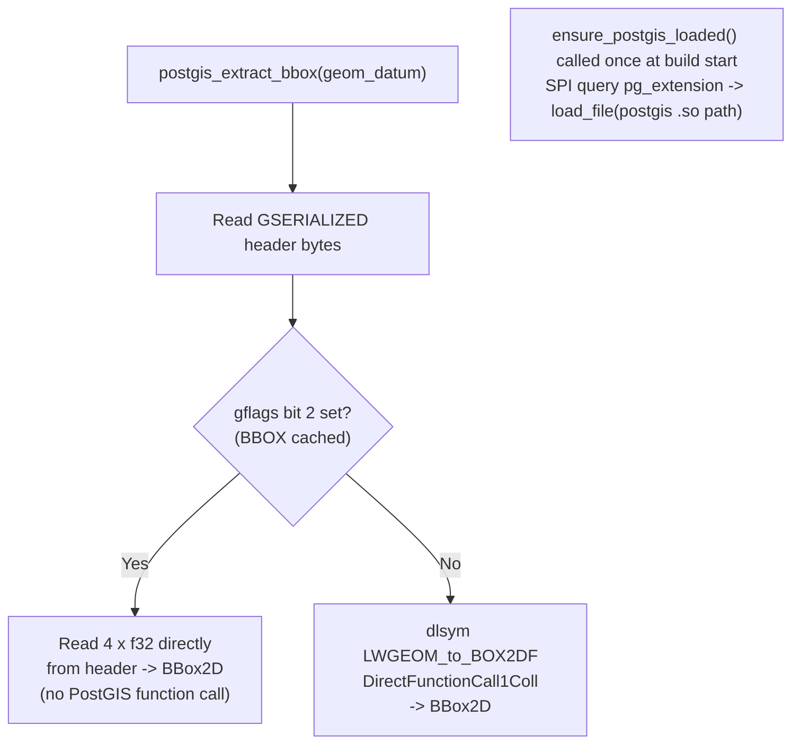

# Architecture

## Overview

`geo_vec` is a PostgreSQL access method extension that combines vector similarity search (DiskANN graph) with spatial filtering (grid-based cell index) and label filtering in a single composite index.

It is a fork of [pgvectorscale](https://github.com/timescale/pgvectorscale), adding the spatial cell index, label filtering, and three-way query routing.



## Module Map

```
src/
├── lib.rs                    ← Extension entry (_PG_init, distance init, GUC registration)
│
├── access_method/            ← Core index implementation
│   ├── mod.rs                ← amhandler(), operator classes (extension_sql!)
│   ├── build.rs              ← Index build: heap scan → graph insert → spatial finalization
│   ├── build/parallel.rs     ← Parallel build coordination (PG17+)
│   ├── scan.rs               ← Query: three-way routing, amrescan/amgettuple
│   ├── meta_page.rs          ← MetaPage: index metadata (dimensions, flags, pointers)
│   ├── spatial_index.rs      ← SpatialCellIndex: CSR grid, seed sampling, bbox lookup
│   ├── storage.rs            ← Storage trait (abstraction over Plain / SBQ)
│   ├── storage_common.rs     ← Shared helpers (attribute access)
│   │
│   ├── graph/
│   │   ├── mod.rs            ← DiskANN graph: greedy search, robust prune
│   │   ├── neighbor_store.rs ← In-memory neighbor cache during build
│   │   ├── neighbor_with_distance.rs
│   │   └── start_nodes.rs    ← Entry points for graph search
│   │
│   ├── plain/                ← Full-precision storage
│   │   ├── storage.rs        ← PlainStorage: read/write f32 vectors
│   │   ├── node.rs           ← PlainNode: vector + bbox + labels + neighbors
│   │   └── tests.rs
│   │
│   ├── sbq/                  ← Scalar Binary Quantization storage
│   │   ├── storage.rs        ← SbqSpeedupStorage: quantized search + rescore
│   │   ├── node.rs           ← SbqNode: quantized vector + metadata
│   │   ├── quantize.rs       ← SbqQuantizer: online mean/variance training
│   │   ├── cache.rs          ← Quantizer cache
│   │   └── tests.rs
│   │
│   ├── labels/
│   │   ├── mod.rs            ← LabelSet, LabeledVector (sorted smallint sets)
│   │   └── filtering_tests.rs
│   │
│   ├── distance/
│   │   ├── mod.rs            ← DistanceType enum, dispatch
│   │   ├── distance_x86.rs   ← AVX2 + FMA SIMD
│   │   └── distance_aarch64.rs ← NEON SIMD
│   │
│   ├── options.rs            ← TSVIndexOptions (WITH clause parsing)
│   ├── guc.rs                ← GUC parameters (search_list_size, brute_force_threshold, ...)
│   ├── type_utils.rs         ← geometry_type_oid(), is_geometry_column()
│   ├── pg_vector.rs          ← PgVector: wrapper for pgvector's vector type
│   ├── node.rs               ← ReadableNode / WriteableNode traits
│   ├── cost_estimate.rs      ← amcostestimate(): spatial sel + LIMIT + brute/hybrid/graph work
│   ├── vacuum.rs             ← ambulkdelete(), amvacuumcleanup()
│   ├── stats.rs              ← Internal statistics
│   └── debugging.rs
│
├── partition/
│   ├── mod.rs                ← BBox2D (spatial bounding box arithmetic)
│   └── postgis.rs            ← GSERIALIZED bbox extraction, dlsym PostGIS loading
│
└── util/
    ├── mod.rs                ← ItemPointer (BlockNumber, OffsetNumber)
    ├── page.rs               ← PageType enum, ReadablePage / WritablePage
    ├── tape.rs               ← Tape: single-page item allocator
    ├── chain.rs              ← ChainTapeWriter: multi-page large items
    ├── buffer.rs             ← PostgreSQL buffer lock wrappers
    ├── lru.rs                ← LRU cache (neighbor cache during build)
    ├── table_slot.rs         ← TableSlot: heap tuple reader (for rescore)
    └── ports.rs              ← FFI wrappers for PG C functions
```

## Index Build



### Parallel Build (PG17+)

For large tables, PG17's parallel index build is used. The leader coordinates workers via shared state and condition variables. Workers wait until start nodes are initialized (first N tuples processed sequentially), then build the graph concurrently.

## Three-Way Query Routing

The scan path selects a strategy based on the query predicates and the estimated number of spatial candidates:



### Why Three Paths?

| Path | When | Cost | Recall |
|---|---|---|---|
| **Brute-force** | Small bbox (few candidates) | O(candidates) | 100% |
| **Hybrid** | Large bbox (many candidates) | O(search_list_size) | ~95-100% |
| **Graph** | No bbox | O(search_list_size) | ~95-100% |

Brute-force is exact but expensive for large regions. Hybrid seeds the DiskANN graph with spatially-relevant entry points, achieving near-perfect recall at fixed cost. The threshold (GUC `geo_vec.spatial_brute_force_threshold`, default 5000) controls the crossover.

## Incremental CSR (inserts after build)

After `CREATE INDEX`, the base CSR blob is not rewritten on every insert. Instead:

1. **INSERT** — node is written to the DiskANN graph as before; its `(cell_id, IndexPointer)` postings are appended to a `SpatialOverflowIndex` ChainTape (`PageType::SpatialOverflow`), referenced from MetaPage.
2. **Scan** — `nodes_in_bbox` / `sample_seeds_in_bbox` union base CSR + overflow (deleted nodes still filtered at read time).
3. **Compact** — when overflow postings ≥ `geo_vec.spatial_overflow_compact_threshold`, or on index `VACUUM`, rebuild CSR via graph walk and clear overflow.

If the index was built with no rows, the first geometry insert creates a one-node CSR. Inserts outside the original grid extent clamp into boundary cells until the next compact recomputes extent.

## Planner Cost Estimation

Runtime already knows CSR candidate counts when the scan starts. The planner must decide **before** that — via `amcostestimate` in `cost_estimate.rs` — whether to use `geo_vec` vs HNSW+GiST (or seqscan).

### What the cost model estimates

1. **Spatial selectivity** — `clauselist_selectivity` on indexclause RestrictInfos (typically `geom && bbox`).
2. **Candidate count** — `cand ≈ selectivity × n`.
3. **Work (numIndexTuples)** aligned with scan routing:
   - no spatial qual → graph work ~ `search_list` (not `n/100`)
   - `cand ≤ spatial_brute_force_threshold` → brute → examine ~`cand`
   - else → hybrid → seed + graph work (grows with `√cand`, capped by `cand`)
4. **Return selectivity** — ANN `ORDER BY … LIMIT k` returns ≈ `k` rows (`PlannerInfo.limit_tuples`, else `search_list`).



### Why this matters (Kigoto)

On ~318K rows, a **narrow/medium** bbox needs geo_vec for recall (HNSW+GiST often returns 0–1 of the true top-20). A **wide** bbox (~57% of rows) is a weak filter: both AMs can hit 20/20 recall, so cost/cardinality should not treat every bbox the same.

| Bbox | Competing indexes — old `n/100` | Competing indexes — current model |
|---|---|---|
| tiny | geo_vec | geo_vec |
| narrow | HNSW | geo_vec |
| medium | HNSW | geo_vec |
| wide | HNSW | geo_vec (cost rises vs narrow) |

Smoke: `make bench-planner-choice` (builds `kigoto_planner` with geo_vec + HNSW + GiST). Details and numbers: [README Benchmarks](../README.md#benchmarks).

### Limits

- Selectivity quality depends on Postgres/PostGIS stats for `&&`; bad stats ⇒ wrong `cand`.
- The model approximates CSR counts; it does not read the CSR at plan time.
- Preferring geo_vec on very wide filters may overshoot effective QPS — tune thresholds / revisit costs if production plans look wrong.

Further planner and scan improvements (wide-bbox penalty, MetaPage histograms, incremental CSR, spatial node layout): [ROADMAP](ROADMAP.md).

## Spatial Cell Index

A grid-based auxiliary structure stored in CSR (Compressed Sparse Row) format alongside the DiskANN graph.



**CSR storage**: `cell_offsets[i]..cell_offsets[i+1]` indexes into `node_pointers[]` to give all nodes in cell `i`.

- **Auto-sized** to ~100 points per cell
- **Multi-cell assignment**: each node is inserted into every cell its bounding box overlaps (not just its centroid cell). This guarantees that any query bbox overlapping a node's bbox will find it, regardless of geometry size. A small point-like building lands in 1 cell; a large polygon spanning many cells appears in all of them. Typical overhead is ~15-20% extra entries for building-scale data.
- **`nodes_in_bbox()`**: union of all nodes in overlapping grid cells, deduplicated via `HashSet` (since a node may appear in multiple cells)
- **`sample_seeds_in_bbox()`**: evenly-spaced samples from overlapping cells (for hybrid search entry points)
- Serialized to chained pages via `ChainTapeWriter`

## Storage Layer

Two storage backends, selected at index creation (default: SBQ).



**SBQ (Scalar Binary Quantization)** compresses each vector dimension to 1-2 bits using per-dimension mean/variance thresholds. Approximate distances are computed via SIMD XOR + popcount on quantized representations. The top-K candidates are then rescored using full-precision vectors fetched from the heap.

## DiskANN Graph

The graph module implements the DiskANN algorithm:

- **Build**: Incremental insertion with `greedy_search` (find neighbors) + `robust_prune` (select best edges, respecting max degree R)
- **Search**: `greedy_search_streaming()` with a best-first candidate queue, expanding neighbors until `search_list_size` candidates visited
- **Hybrid entry**: `greedy_search_streaming_init_with_seeds()` accepts custom seed nodes from the spatial cell index instead of using fixed start nodes

The graph is fully connected (no partitioning) to maintain high recall for pure vector queries.

## PostGIS Integration

`geo_vec` reads bounding boxes from PostGIS `geometry` values without a link-time dependency:



The geometry column is identified by `format_type_be()` returning `"geometry"`, and uses operator strategy 6 for the `&&` operator in the access method.

## Label Filtering

Labels are stored as sorted `smallint[]` arrays (type `LabelSet`). Filtering uses the `&&` (overlap) operator:

- **Build**: Labels extracted from index datums, stored in each node (PlainNode/SbqNode)
- **Scan**: Query labels parsed from scan key (strategy 1). During graph traversal, nodes whose labels don't overlap the query labels are skipped.
- **Operator**: `geo_vec_smallint_array_overlap()` implements `&&` for `smallint[]`, registered in the `vector_smallint_label_ops` operator class.

## Page Layout

All data is stored in standard 8 KB PostgreSQL pages, managed through the shared buffer pool:

| PageType | Contents | Written via |
|---|---|---|
| `Meta` | MetaPage (index metadata) | ChainTape (block 0) |
| `Node` | PlainNode (full-precision vector nodes) | Tape |
| `SbqNode` | SbqNode (quantized vector nodes) | Tape |
| `SbqMeans` | SbqQuantizer parameters | ChainTape |
| `SpatialCellIndex` | CSR grid arrays | ChainTape |

**Tape**: Allocates items sequentially in pages; each item must fit in a single page.
**ChainTape**: Links pages for large items that span multiple pages (MetaPage, quantizer, spatial index).
